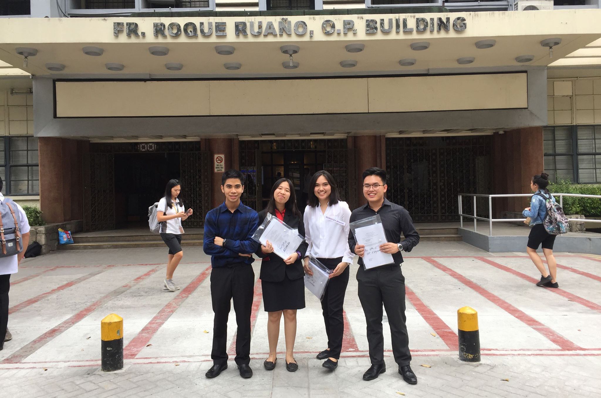

#  ANDY DRIVING

AnDy: Anti Drowsy Driving or <b>Andy Driving</b> is a mobile application for car drivers. It keeps the driver awake and alert to lessen the risk of getting involve in a car accident.

Andy Driving uses the phone's camera to detect the user's eye whether it is open or close. An alarm will trigger when the user close his/her eyes for a short period of time.

You can also find the nearest location such as restaurants, cafes, gas stations and hotels using the application.

Get the latest weather update base on your GPS location.

This system is developed by Team AnDy; 4th year Information Technology students from the Institute of Information and Computing Sciences of the University of Santo Toma,Manila.

## MEET THE TEAM:

Ian Ishmael Oderon - [Facebook](https://www.facebook.com/Ianskie21) | [Github](https://github.com/darknblack) | [Fiverr](https://www.fiverr.com/darknblack) | [LinkedIn](https://www.linkedin.com/in/ian-ishmael-oderon-194090174/)

Marie Anthonette Tan - [Facebook](https://www.facebook.com/aaaaanthonette) | [Github](https://github.com/toni-tan) | [LinkedIn](https://www.linkedin.com/in/marieartan)

Dianne Keizel Gumatay - [Facebook](https://www.facebook.com/diannekeizel.gumatay) | [Github](https://github.com/keizel1007) | [LinkedIn](https://www.linkedin.com/in/dianne-keizel-gumatay-3ba8a5166/)

Christian Adrian Domantay - [Facebook](https://www.facebook.com/christianadrian.domantay) | [Github](https://github.com/ChristianDomantay) | [LinkedIn](https://www.linkedin.com/in/christian-domantay-9a4982165/)